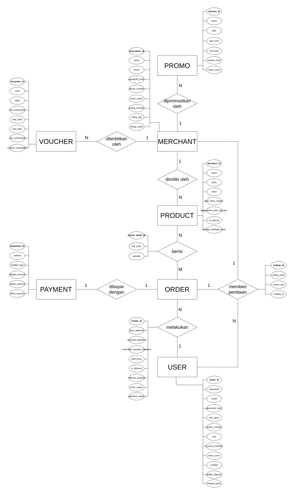
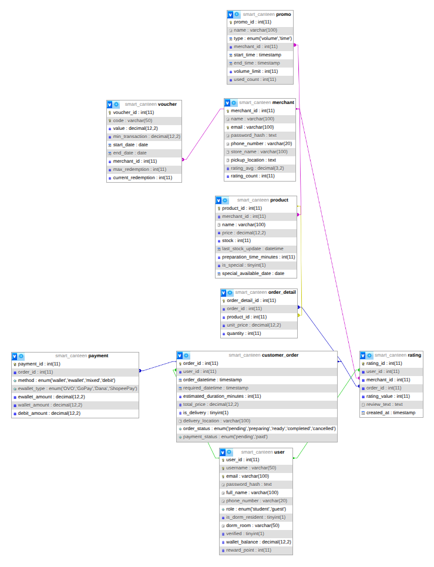

# Laporan Tugas Besar Sistem Basis Data I

- **Drestayumna Nurmareko** – 607062400056  
- **Maikel Buala Beriman Hulu** – 607062430007  
- **Yehezkiel Enrico Bangun** – 6706213082

---

## Daftar Isi

1. [Deskripsi Topik](#deskripsi-topik)
2. [Asumsi Tambahan](#asumsi-tambahan)
3. [Entity Relationship Diagram (ERD)](#entity-relationship-diagram-erd)
4. [Skema Relasi](#skema-relasi)
5. [Deskripsi Tabel](#deskripsi-tabel)
6. [Sintak SQL](#sintak-sql)

---

## Deskripsi Topik

### Topik M – Smart Canteen

**DigiFood Campus** adalah sistem smart kantin digital yang diimplementasikan di sebuah kampus dengan sekitar 5000 mahasiswa. Tujuan utama sistem ini adalah mengurangi antrian panjang saat jam makan siang dan meningkatkan efisiensi pelayanan melalui aplikasi mobile serta sistem kiosk digital.

#### Aturan Bisnis:
1. Pengguna dapat memesan makanan melalui aplikasi mobile atau kiosk di kampus, baik langsung maupun menggunakan fitur pre-order (hingga H-1). Tiap transaksi memiliki nomor antrian digital yang bisa dilacak. Pengguna bisa memiliki banyak pesanan aktif dan dalam satu transaksi dapat memesan dari beberapa merchant sekaligus.
2. Pengguna memilih lokasi pengambilan berdasarkan merchant. Merchant harus menyiapkan pesanan maksimal dalam 1 jam, jika tidak maka statusnya "terlambat". Untuk pesanan multi-merchant, pengambilan dilakukan di kasir yang akan memverifikasi dan memperbarui status pesanan.
3. Pesanan bisa dibatalkan sebelum merchant mengonfirmasi. Modifikasi hanya diperbolehkan sebelum pembayaran. Jika terjadi kesalahan dari merchant, pengguna bisa memilih pengembalian saldo atau substitusi menu.
4. Top-up saldo kantin bisa dilakukan melalui aplikasi, minimarket kampus, atau transfer bank, minimal Rp20.000 dan maksimal Rp2.000.000.
5. Pembayaran dapat dilakukan menggunakan saldo kantin, e-wallet (OVO, GoPay, Dana, ShopeePay), dan kartu debit kampus. Bila menggunakan kombinasi, saldo kantin digunakan terlebih dahulu. Cashback (maksimal 10%) hanya untuk transaksi berikutnya. Reward points diberikan 1 poin per Rp10.000 transaksi dan dapat dikonversi menjadi diskon atau voucher. Biaya pengantaran Rp5.000 jika berlaku.
6. Merchant wajib memperbarui stok setiap 2 jam. Merchant dengan rating < 3.5 selama 3 bulan berturut-turut akan dievaluasi dan dikenai sanksi. Rating dan ulasan dapat diberikan oleh pengguna. Merchant dengan rating > 4.5 selama 6 bulan berturut-turut akan mendapat badge “Top Merchant”.
7. Verifikasi akun lewat email wajib dilakukan sebelum transaksi pertama. Menu spesial harus diajukan H-3 sebelum tampil di aplikasi.
8. Promo terbagi menjadi dua tipe: berdasarkan volume (contoh: 100 orang pertama) dan berdasarkan waktu/periode (contoh: jam 12–13 pada 27–29 Januari). Promo dapat berlaku umum atau terbatas pada merchant tertentu.

---

## Asumsi Tambahan

1. **Login menggunakan SSO Mahasiswa**  
   Sistem menggunakan integrasi Single Sign-On (SSO) kampus untuk autentikasi pengguna aplikasi mobile.

2. **Kiosk digital adalah tablet di meja kantin**  
   Setiap meja di kantin memiliki tablet (kiosk digital) yang dapat digunakan untuk memesan makanan.

3. **Pengguna kiosk tidak perlu login**  
   Pemesanan melalui kiosk tidak memerlukan login, sehingga dapat digunakan secara anonim untuk efisiensi.

4. **Fitur pengantaran (delivery) hanya untuk penghuni asrama**  
   Fitur ini dibatasi untuk mahasiswa yang tinggal di asrama kampus untuk memudahkan distribusi.

5. **Nomor antrian digantikan dengan status pesanan dan estimasi waktu selesai**  
   - **Alasan**: Sistem antrian kurang efisien dalam model pelayanan asinkron.  
   - Sistem memberikan status real-time (misalnya: *dalam antrian, diproses, selesai*) dan estimasi waktu selesai yang lebih relevan bagi pengguna.

6. **Setiap menu memiliki waktu persiapan masing-masing**  
   - **Alasan**: Waktu persiapan berbeda untuk setiap jenis makanan. Informasi ini digunakan untuk menghitung estimasi penyelesaian pesanan.

---

## Entity Relationship Diagram (ERD)

---

## Skema Relasi

---

## Deskripsi Tabel

### 1. Tabel `user`
- **Jenis Tabel**: Master  
- **Laju**: 6.000/tahun  
- **Deskripsi**: Menyimpan informasi pengguna sistem.

#### Atribut:

| Nama Atribut       | Tipe Data               | Keterangan                  |
| ------------------ | ----------------------- | --------------------------- |
| user\_id           | INT                     | Primary Key, Auto Increment |
| username           | VARCHAR(50)             | Unique                      |
| email              | VARCHAR(100)            | Not Null, Unique            |
| password\_hash     | TEXT                    | Not Null                    |
| full\_name         | VARCHAR(100)            | Not Null                    |
| phone\_number      | VARCHAR(20)             | Opsional                    |
| role               | ENUM('student','guest') | Not Null                    |
| is\_dorm\_resident | BOOLEAN                 | Default FALSE               |
| dorm\_room         | VARCHAR(50)             | Opsional                    |
| verified           | BOOLEAN                 | Default FALSE               |
| wallet\_balance    | DECIMAL(12,2)           | Maksimal Rp 2.000.000       |
| reward\_point      | INT                     | Default 0                   |

---

### 2. Tabel `merchant`
- **Jenis Tabel**: Master  
- **Laju**: 25/tahun  
- **Deskripsi**: Menyimpan informasi pemilik usaha kantin, termasuk login, lokasi pickup, dan rating.

#### Atribut:

| Nama Atribut     | Tipe Data    | Keterangan                  |
| ---------------- | ------------ | --------------------------- |
| merchant\_id     | INT          | Primary Key, Auto Increment |
| name             | VARCHAR(100) | Not Null                    |
| email            | VARCHAR(100) | Not Null, Unique            |
| password\_hash   | TEXT         | Not Null                    |
| phone\_number    | VARCHAR(20)  | Not Null                    |
| store\_name      | VARCHAR(100) | Not Null                    |
| pickup\_location | TEXT         | Not Null                    |
| rating\_avg      | DECIMAL(3,2) | Default 0.00                |
| rating\_count    | INT          | Default 0                   |

---

### 3. Tabel `product`
- **Jenis Tabel**: Master  
- **Laju**: 500/tahun  
- **Deskripsi**: Menyimpan data menu yang ditawarkan oleh merchant termasuk stok dan waktu persiapan.

#### Atribut:

| Nama Atribut               | Tipe Data     | Keterangan                  |
| -------------------------- | ------------- | --------------------------- |
| product\_id                | INT           | Primary Key, Auto Increment |
| merchant\_id               | INT           | Foreign Key ke `merchant`   |
| name                       | VARCHAR(100)  | Not Null                    |
| price                      | DECIMAL(12,2) | Not Null                    |
| stock                      | INT           | Default 0                   |
| last\_stock\_update        | DATETIME      | Not Null                    |
| preparation\_time\_minutes | INT           | Not Null                    |
| is\_special                | BOOLEAN       | Default FALSE               |
| special\_available\_date   | DATE          | Not Null                    |

---

### 4. Tabel `customer_order`
- **Jenis Tabel**: Transaksi  
- **Laju**: 60.000/tahun  
- **Deskripsi**: Mencatat transaksi pemesanan makanan oleh pengguna.

#### Atribut:

| Nama Atribut                 | Tipe Data                                                   | Keterangan                  |
| ---------------------------- | ----------------------------------------------------------- | --------------------------- |
| order\_id                    | INT                                                         | Primary Key, Auto Increment |
| user\_id                     | INT                                                         | Foreign Key ke `user`       |
| order\_datetime              | TIMESTAMP                                                   | Default CURRENT\_TIMESTAMP  |
| required\_datetime           | TIMESTAMP                                                   | Default CURRENT\_TIMESTAMP  |
| estimated\_duration\_minutes | INT                                                         | Not Null                    |
| completed_datetime | TIMESTAMP                                                         | Not Null                    |
| total\_price                 | DECIMAL(12,2)                                               | Not Null                    |
| pickup_location | VARCHAR(100)                                                | Opsional                    |
| is\_delivery                 | BOOLEAN                                                     | Default FALSE               |
| delivery\_location           | VARCHAR(100)                                                | Opsional                    |
| order\_status                | ENUM('pending','preparing','ready','completed','cancelled') | Default 'pending'           |

---

### 5. Tabel `order_detail`
- **Jenis Tabel**: Transaksi  
- **Laju**: 100.000/tahun  
- **Deskripsi**: Mencatat rincian tiap pesanan seperti produk yang dibeli, jumlah, dan harga satuan.

#### Atribut:

| Nama Atribut      | Tipe Data     | Keterangan                      |
| ----------------- | ------------- | ------------------------------- |
| order\_detail\_id | INT           | Primary Key, Auto Increment     |
| order\_id         | INT           | Foreign Key ke `customer_order` |
| product\_id       | INT           | Foreign Key ke `product`        |
| unit\_price       | DECIMAL(12,2) | Not Null                        |
| quantity          | INT           | Default 1                       |

---

### 6. Tabel `payment`
- **Jenis Tabel**: Transaksi  
- **Laju**: 60.000/tahun  
- **Deskripsi**: Menyimpan informasi metode dan jumlah pembayaran untuk setiap pesanan.

#### Atribut:

| Nama Atribut    | Tipe Data                                | Keterangan                      |
| --------------- | ---------------------------------------- | ------------------------------- |
| payment\_id     | INT                                      | Primary Key, Auto Increment     |
| order\_id       | INT                                      | Foreign Key ke `customer_order` |
| method          | ENUM('wallet','ewallet','mixed','debit') | Not Null                        |
| ewallet\_amount | DECIMAL(12,2)                            | Default 0.00                    |
| wallet\_amount  | DECIMAL(12,2)                            | Default 0.00                    |
| debit\_amount   | DECIMAL(12,2)                            | Default 0.00                    |

---

### 7. Tabel `rating`
- **Jenis Tabel**: Transaksi  
- **Laju**: 40.000/tahun  
- **Deskripsi**: Menyimpan ulasan dan nilai rating dari pengguna terhadap merchant setelah transaksi selesai.

#### Atribut:

| Nama Atribut  | Tipe Data | Keterangan                      |
| ------------- | --------- | ------------------------------- |
| rating\_id    | INT       | Primary Key, Auto Increment     |
| user\_id      | INT       | Foreign Key ke `user`           |
| merchant\_id  | INT       | Foreign Key ke `merchant`       |
| order\_id     | INT       | Foreign Key ke `customer_order` |
| rating\_value | INT       | Check: 1–5                      |
| review\_text  | TEXT      | Opsional                        |
| created\_at   | TIMESTAMP | Default CURRENT\_TIMESTAMP      |

---

### 8. Tabel `voucher`
- **Jenis Tabel**: Referensi  
- **Laju**: 100/tahun  
- **Deskripsi**: Menyimpan informasi kode voucher, nilai diskon, dan batas penggunaan.

#### Atribut:

| Nama Atribut        | Tipe Data     | Keterangan                  |
| ------------------- | ------------- | --------------------------- |
| voucher\_id         | INT           | Primary Key, Auto Increment |
| code                | VARCHAR(50)   | Unique, Not Null            |
| value               | DECIMAL(12,2) | Not Null                    |
| min\_transaction    | DECIMAL(12,2) | Opsional                    |
| start\_date         | DATE          | Opsional                    |
| end\_date           | DATE          | Opsional                    |
| merchant\_id        | INT           | Foreign Key ke `merchant`   |
| max\_redemption     | INT           | Not Null                    |
| current\_redemption | INT           | Default 0                   |

---

### 9. Tabel `promo`
- **Jenis Tabel**: Referensi  
- **Laju**: 50/tahun  
- **Deskripsi**: Menyimpan data promo berdasarkan waktu atau volume pengguna serta merchant terkait.

#### Atribut:

| Nama Atribut  | Tipe Data             | Keterangan                  |
| ------------- | --------------------- | --------------------------- |
| promo\_id     | INT                   | Primary Key, Auto Increment |
| name          | VARCHAR(100)          | Not Null                    |
| type          | ENUM('volume','time') | Not Null                    |
| merchant\_id  | INT                   | Foreign Key ke `merchant`   |
| start\_time   | TIMESTAMP             | Opsional                    |
| end\_time     | TIMESTAMP             | Opsional                    |
| volume\_limit | INT                   | Opsional                    |
| used\_count   | INT                   | Default 0                   |

---

## Sintak SQL

---
